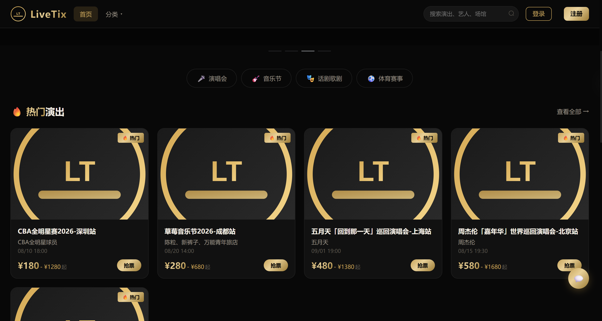
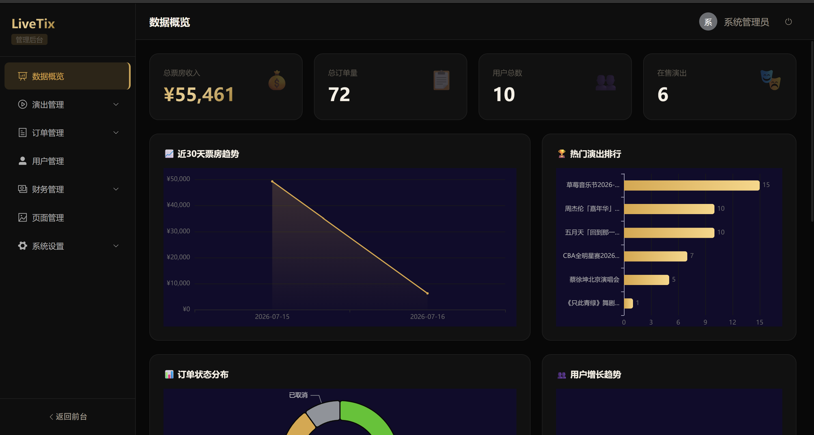
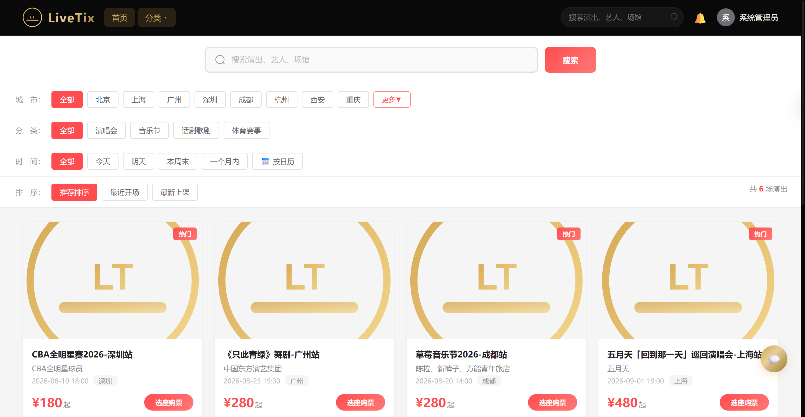
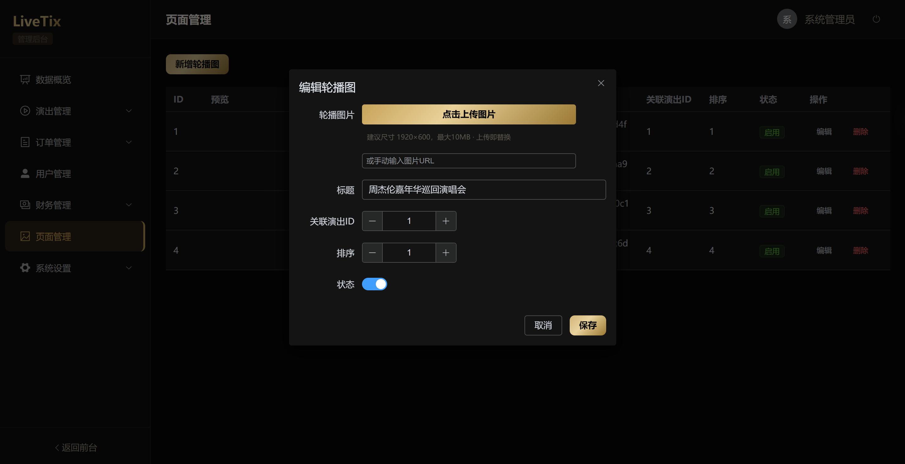

# LiveTix - 票务交易系统

大三课设，一个演出票务平台，主要练手高并发抢票。

## 技术栈

- 后端：SpringBoot 2.7 + MyBatis-Plus + Sa-Token + Redis + RocketMQ
- 前端：Vue3 + Element Plus
- 部署：Docker Compose

## 做了啥

抢票这块折腾最久。一开始用 synchronized 简单粗暴，结果压测到 200 QPS 就开始超卖了，心态爆炸。后来换成 Redis + Lua 脚本原子扣库存，500 QPS 稳住了。

订单超时取消用的 RocketMQ 延迟消息，下单后 15 分钟没付钱自动取消、退库存。还写了个定时任务兜底，万一 MQ 抽风了也不至于库存卡死在那。

缓存搞了三层：布隆过滤器挡掉不存在的演出 ID、缓存空值防穿透、SET NX 互斥锁防击穿。选座用了 Redis 分布式锁，同一个座位同一时间只能有一个人抢，不然就乱套了。

后台管理就是常规的 CRUD：演出管理、订单管理、退款审核、Banner 轮播图、用户管理。权限用 Sa-Token 的 RBAC，角色-菜单-权限那一套。

## 怎么跑

得有 Docker Desktop。

```bash
git clone https://github.com/Evan7J/LiveTix.git
cd LiveTix
docker compose up -d
```

然后浏览器打开 http://localhost:3000。

管理员后台：http://localhost:3000/admin，账号 `admin`，密码 `admin123`。

## 页面截图

首页：



后台 Dashboard：



演出管理：



Banner 管理：

